# 03_Labspy02

BAHASA PEMROGRAMAN

TEKNIK INFORMATIKA

UNIVERSITAS PELITA BANGSA

NAMA : GUNAWAN

NIM     : 312010191

KELAS   : TI.20.B1

DOSEN   : Agung Nugroho,S.Kom.,M.Kom

Tugas   : Praktikum 2
1. Buat repository dengan nama labspy02

2. Buat program sederhana dengan input tiga buah bilangan, dari ketiga bilangan
tersebut tampilkan bilangan terbesarnya. Gunakan statement if.
3. Uraikan langkah atau algoritmanya pada file README.md, sertakan juga flowchart
dan screenshot hasil eksekusi program. Tampilkan 3 kondisi inputan data.
4. Commit dan push pada repository

5. submit  repository pada classroom 

# **Latihan 1 : Membuat program menentukan nilai akhir**
       
- Kita ketik Code perintah python yang sudah kita buat nama Latihan1.py :   
 
  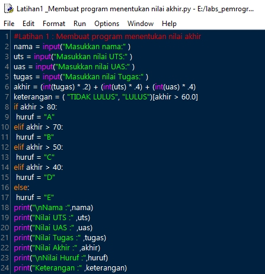
  
- **Kode Input**

Pada program menggunakan kode input untuk memasukkan nilai variable:

    nama = input("Masukkan nama:" )
    uts = input("Masukkan nilai UTS:" )
    uas = input("Masukkan nilai UAS:" )
    tugas = input("Masukkan nilai Tugas:" )
    
Dan untuk Kode perhitungan dan logika untuk menentukan Lulus dengan kode"akhir" Nilai Lebih besar dari 60 & Tidak Lulus apabila kurang dari nilai 60

    akhir = (int(tugas) * .2) + (int(uts) * .4) + (int(uas) * .4)
    keterangan = ( "TIDAK LULUS", "LULUS")[akhir > 60.0]

- **Pernyataan if … elif … else**
 
Pada python dikenal penggunaan struktur kondisi menggunakan statement if,elif dan else dimana
format/syntax penggunaan statement if … elif... else adalah:

syntax:

    if kondisi:
    statement_true
    elif kondisi2:
    statement_true
    else:
    statement_false

Contoh dalam program penggunaan statement if :

    if akhir > 80:
     huruf = "A"
    elif akhir > 70:
     huruf = "B"
    elif akhir > 50:
    huruf = "C"
    elif akhir > 40:
    huruf = "D"
    else:
    huruf = "E"
    
- **Kode Output**   
Untuk menampilkan hasil akhir menggunakan code print.

Berikut tampilan hasil code program setelah di Run :
- Kondisi Lulus

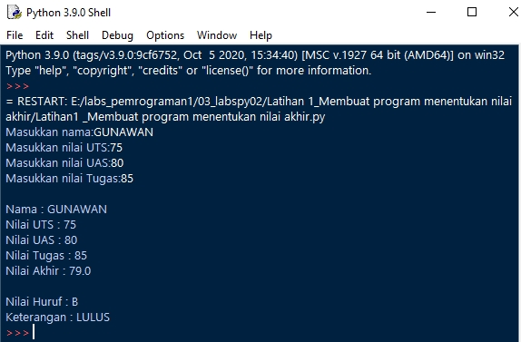
    
- Kondisi Tidak Lulus

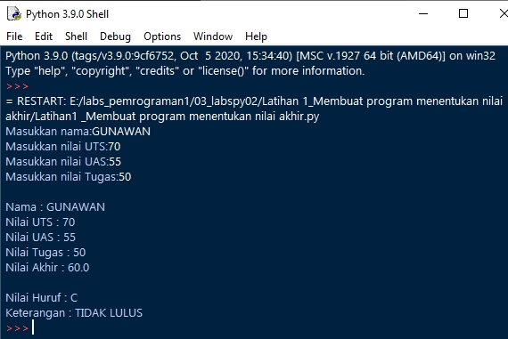

- Latihan 2: Membuat program menampilkan status gaji karyawan.

# **Latihan 2: Membuat program menampilkan status gaji karyawan.**

- Kita ketik Code perintah python yang sudah kita buat nama Latihan2.py : 

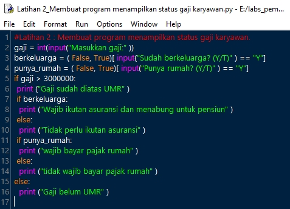

- Berikut tampilan hasil code program setelah di Run :

- Kondisi Gaji sudah diatas UMR

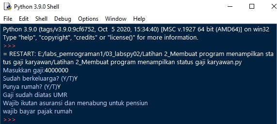

- Kondisi Gaji Belum UMR

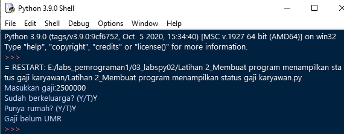

- Kondisi Gaji Di atas UMR tapi tidak berkeluarga dan tidak punya rumah

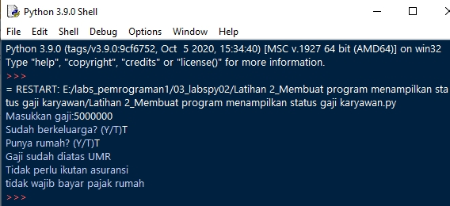

# Latihan 3: penggunaan kondisi OR program membandingkan 3 input bilangan, apabila penjumlahan 2 bilangan hasilnya sama dengan bilangan lainnya, maka cetak pernyataan “BENAR”.

- Kita ketik Code perintah python yang sudah kita buat nama Latihan3.py : 

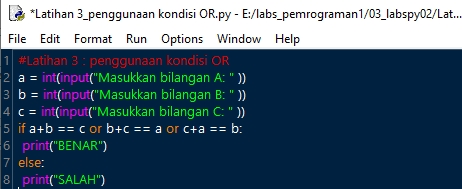

untuk Kode perhitungan dan logika untuk menentukan BENAR jika Nilai yang dinputkan perhitungan nila A dan B =C atau B dan C=A atau C dan A=B,jika hasil berbeda maka SALAH.

- Berikut tampilan hasil code program setelah di Run :

- Kondisi Perhitungan yang BENAR

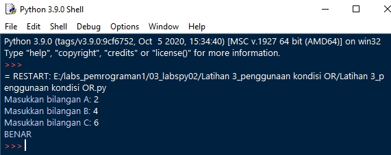

- Kondisi Perhitungan yang SALAH

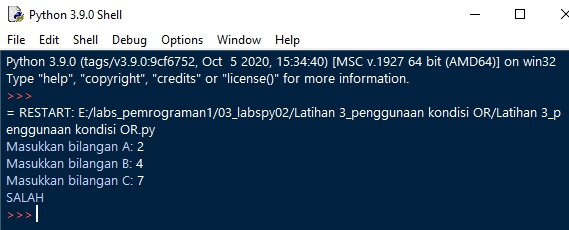

# **Latihan 4 : Tugas praktikum 2.**

- Buat program sederhana dengan input tiga buah bilangan, dari ketiga bilangan
tersebut tampilkan bilangan terbesarnya. Gunakan statement if.

Kita ketik Code perintah python yang sudah kita buat nama Latihan4.py : 

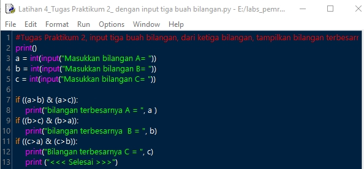

- Berikut adalah Uraian langkah atau algoritmanya : 

     1. Mendeklarasikan variabel int A, B, C, sebagai variabel input
     2. Membaca input Dari keyboard  >> A >> B >> C
     3. Membandingkan variabel nilai yang Lebih besar dengan tanda ">"
     4. Kondisi if maka bandingkan nilai variabel A>B dan A>C =A
     5. Kondisi if maka bandingkan nilai variabel B>C dan B>A =B
     6. Kondisi if maka bandingkan nilai variabel C>A dan C>B =C
     
- Berikut adalah Flowchartnya : 

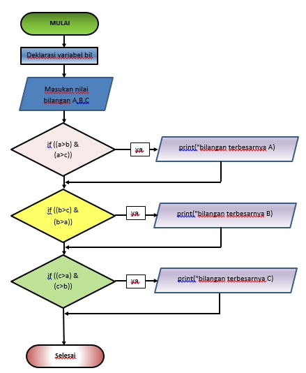

- Berikut tampilan hasil code program Dengan 3 kondisi inputan data setelah di Run :

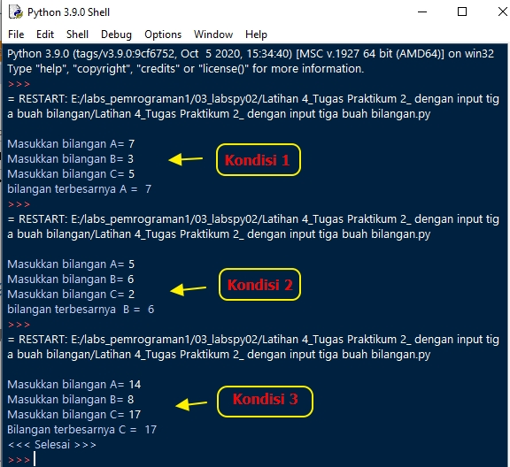

Cukup Sekian Penjelasan Tugas Dari Saya.

**TERIMAKA KASIH**
